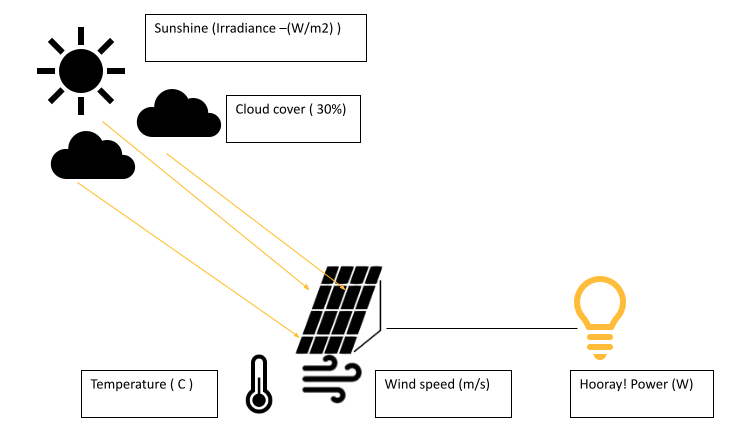

# [Shell Solar Power Prediction](https://www.hackerearth.com/challenges/competitive/shell-ai-hackathon-2021/")

## Content
- The Challenge
- Rules
- Evaluation
- Solution Approaches

## Introduction
Tackling climate change is an urgent challenge. Shell is transforming to become a net-zero emissions energy business by 2050, in step with society and our customers. We are exploring new opportunities to provide more low-carbon energy such as biofuels, hydrogen, charging for electric vehicles, and electricity generated by solar and wind power. To achieve this, we are working collaboratively on early-stage ideas with the potential to impact the future of energy.

Solar power is one of the fastest-growing renewable energy sources. Global solar photovoltaic (PV) generation is now almost 3% of the total electricity mix and will increase by 15% annually, from 720 TWh in 2019 to almost 3,300 TWh in 2030.

However, the major challenge with solar PV power production is its intermittency caused by variable weather conditions. Cloud coverage can cast shade over the solar farms in a few minutes and significantly reduce power production. Other factors such as ambient temperature, humidity, and wind speed can also affect the PV temperature and power output. Since grid operations management is based on a delicate balance between supply and demand, any uncertainty in energy production (or consumption) could pose a risk to a grid network.

Predicting the intermittency in advance can be of tremendous value, in the following ways:
- Grid operators can schedule deferrable loads to run on clean solar power, increasing the overall share of clean power in the energy mix.

- Producers don't have to sell energy at a low or negative price, having sufficient incentive to run a solar business.

Cloud coverage remains one of the big risk factors. For example, opaque clouds over the solar farm could reduce the power output by 50-80% in a short interval., causing severe network failures. One way of mitigating this risk requires an accurate prediction of solar irradiance by modeling cloud behavior. Therefore, in this hackathon, we are asking you to predict solar irradiance for short timescales of up to 120 minutes using data-driven models to improve the robustness of the grid.

## Problem Statement
The main challenge is to forecast solar irradiance for a specific region of interest given local weather conditions and sky camera images. The problem is divided into 2 levels.  As irradiance has a high correlation with cloud coverage the first level of the hackathon is to forecast cloud coverage. In the second level, you will be asked to tackle the complex challenge of predicting solar irradiance to improve the quality of short-term power forecasts.

**Level 1**

Predicting cloud cover in a short time span of 120 minutes is very challenging. On this time scale, changes in local cloud cover are driven by a combination of dynamical and physical parameters such as wind speed, wind direction sea-level pressure, humidity, and temperature over the asset of our interest. Short interval cloud cover prediction requires accurate estimates of cloud motion and presence using weather data and sky camera images or physics-based weather models or a combination of both. In this level, you are expected to predict the total cloud coverage as a percentage of the open sky for a fixed field of view at 4 horizon intervals of 30, 60, 90, and 120 minutes from a 6-hour window of historical data.

References:
- NREL
- IEA report 2020
- Shell internal research

## The Data

Dataset is available at https://he-public-data.s3.ap-southeast-1.amazonaws.com/shell_dataset.zip

The dataset contains the following :

- **train (folder):**  366 sub-folders ( containing sky images )  and a train.csv file.
- **train.csv:**  527040 x 17
- **test (folder):** 300 sub-folders ( containing sky images and a weather_data.csv file )
- **weather_data.csv:**  361 x 16
- **test.csv:** 300 x 5
- **sample_submission.csv:** 5 x 5

**Train Set:**

- 1-year raw sky camera images at 10-minutes frequency
- 1-year local weather data at 1-minute frequency

**Sampling Frequency:** Sampling the data is part of the challenge. Consider the followings.

- Sample frequency to be consistent with forecast horizon.
- Since weekdays and weekends may have different distributions, consider your training set carefully 
- Balance your dataset throughout the year

**Test Set:**

You will be provided with 300 sets of test data, distributed over a year. The test set will have the same format as the training data. Each test set consists of the following:

- A set of images from the same camera at a 10-minute frequency, covering a time span of 6 hours. 
- Weather information at 1-minute frequency, covering the same 6-hour window

## Evaluation
The metric to evaluate the performance of the solution will be MAE (Mean Absolute Error).

The output of your phase 1 results can directly impact your phase 2 output so make sure you think about the overarching aim of this exercise.

`score = max( 0, 100 - MAE(actual, predicted))`

## Submission

Participants are requested to submit four predictions for each problem set:

- Percentage of total cloud cover estimated in the next 30 minutes
- Percentage of total cloud cover estimated in the next 60 minutes
- Percentage of total cloud cover estimated in the next 90 minutes
- Percentage of total cloud cover estimated in the next 120 minutes

**Result Submission Guidelines:**

- You must submit the submission file in **.csv** format only.
- The size of this submission file must be **300 x 5**.

**Note:**  Ensure that your submission file contains the followings.

- Correct index values as per the test.csv file
- Correct names of columns as provided in the test.csv file
- Column names without any spaces in them

## Solution Approaches
1. Exploratory Data Analysis (EDA)
2. Preprocessing
3. Feature Engineering
4. Modeling with Neural Network
5. Validation

